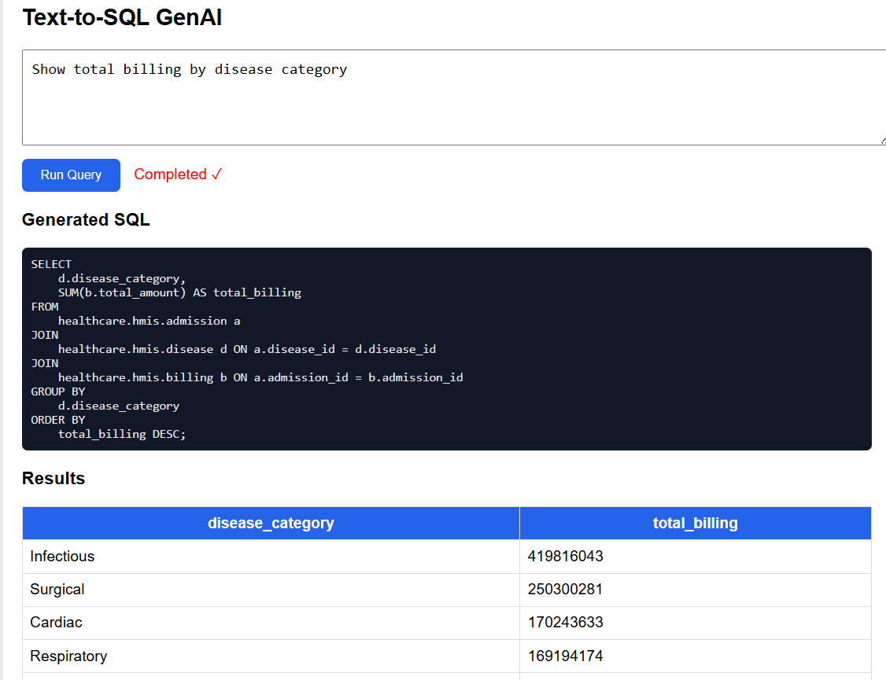

# Text-to-SQL GenAI (Healthcare Analytics)

A **Generative AI–powered Text-to-SQL system** that converts natural language questions into SQL queries and executes them on a **Databricks healthcare dataset**.

This project demonstrates:

* Dynamic schema-aware prompt generation
* LLM-based SQL generation
* Query execution in Databricks


---
# Data set 
---
https://www.kaggle.com/datasets/shalakagangurde/hospital-hmis-dataset-for-healthcare-analytics/data
---

# Project Architecture
---

---
```
User Question
      │
      ▼
Prompt Builder (schema + rules)
      │
      ▼
LLM (Groq / Llama)
      │
      ▼
Generated SQL
      │
      ▼
SQL Cleaner & Validator
      │
      ▼
Databricks SQL Warehouse
      │
      ▼
Query Results
      │
      ▼
Accuracy Test Harness
```

---

# Key Components

| Component            | Purpose                                  |
| -------------------- | ---------------------------------------- |
| Prompt Builder       | Creates schema-aware prompts for the LLM |
| LLM (Groq)           | Converts natural language to SQL         |
| SQL Cleaner          | Removes markdown/code fences             |
| Databricks Connector | Executes SQL queries                     |
| Test Harness         | Evaluates accuracy                       |

---

# Folder Structure

```
text-to-sql-genai/
│
├── app/
│   ├── db.py            # Handles database connection and SQL execution
│   ├── llm.py           # Manages interaction with the LLM to generate SQL
│   ├── main.py          # FastAPI entry point and API endpoint definitions
│   ├── models.py        # Pydantic models for request and response validation
│   └── prompt.py        # Stores prompt templates for SQL generation
│
├── frontend/
│   └── index.html       # Simple web UI to ask questions and view results
│
├── .env                 # Environment variables and secret credentials
├── requirements.txt     # Python dependencies for the project
└── README.md            # Project documentation and setup instructions
```

---

# Setup Instructions

## 1. Install dependencies
```bash
pip install -r requirements.txt
````

Example `requirements.txt`:

```
databricks-sql-connector
python-dotenv
groq
fastapi
uvicorn
```

---

## 2. Configure `.env`

```
# Copy example file
cp .env.example .env

# Then edit .env and add your real credentials


DATABRICKS_SERVER_HOSTNAME=your-host
DATABRICKS_HTTP_PATH=your-http-path
DATABRICKS_TOKEN=your-token
GROQ_API_KEY=your-groq-key
```

---

## 3. run the app
```
uvicorn app.main:app --reload
```
---

# 50-Question Benchmark (Tabular View)

| #  | Question                                        | Category     | Difficulty |
| -- | ----------------------------------------------- | ------------ | ---------- |
| 1  | Show total patients                             | Patient      | Easy       |
| 2  | Show number of male and female patients         | Patient      | Easy       |
| 3  | Show patient count by city                      | Patient      | Easy       |
| 4  | Show patients born after 2000                   | Patient      | Easy       |
| 5  | Show patient count by blood group               | Patient      | Easy       |
| 6  | Show total admissions                           | Admission    | Easy       |
| 7  | Show number of admissions by department         | Admission    | Easy       |
| 8  | Show admissions by admission type               | Admission    | Easy       |
| 9  | Show currently admitted patients                | Admission    | Medium     |
| 10 | Show average length of stay                     | Admission    | Medium     |
| 11 | Show total billing amount                       | Billing      | Easy       |
| 12 | Show total billing by department                | Billing      | Medium     |
| 13 | Show average bill amount                        | Billing      | Easy       |
| 14 | Show total billing by payment mode              | Billing      | Easy       |
| 15 | Show unpaid billing amount                      | Billing      | Medium     |
| 16 | Show total insurance-covered amount             | Insurance    | Easy       |
| 17 | Show total billing by insurance provider        | Insurance    | Medium     |
| 18 | Show number of patients per insurance provider  | Insurance    | Medium     |
| 19 | Show average coverage percentage by provider    | Insurance    | Medium     |
| 20 | Show patients with expired insurance policies   | Insurance    | Medium     |
| 21 | Show number of admissions by disease            | Clinical     | Medium     |
| 22 | Show most common diseases                       | Clinical     | Medium     |
| 23 | Show disease count by category                  | Clinical     | Easy       |
| 24 | Show average billing by disease                 | Clinical     | Hard       |
| 25 | Show top 5 diseases by admission count          | Clinical     | Medium     |
| 26 | Show number of diagnostic tests performed       | Diagnostic   | Easy       |
| 27 | Show diagnostic test count by department        | Diagnostic   | Medium     |
| 28 | Show most frequently performed diagnostic tests | Diagnostic   | Medium     |
| 29 | Show diagnostic tests by test category          | Diagnostic   | Easy       |
| 30 | Show diagnostic count per admission             | Diagnostic   | Hard       |
| 31 | Show total number of prescriptions              | Pharmacy     | Easy       |
| 32 | Show most prescribed drugs                      | Pharmacy     | Medium     |
| 33 | Show prescription count by drug category        | Pharmacy     | Medium     |
| 34 | Show total drug cost per admission              | Pharmacy     | Hard       |
| 35 | Show drugs with low inventory                   | Pharmacy     | Easy       |
| 36 | Show total employees                            | Staff        | Easy       |
| 37 | Show employee count by department               | Staff        | Easy       |
| 38 | Show doctor count by specialization             | Staff        | Medium     |
| 39 | Show average doctor experience by department    | Staff        | Hard       |
| 40 | Show staff assigned per ward                    | Staff        | Medium     |
| 41 | Show bed count by ward                          | Facility     | Easy       |
| 42 | Show available beds                             | Facility     | Easy       |
| 43 | Show occupied beds by department                | Facility     | Medium     |
| 44 | Show ward capacity by department                | Facility     | Easy       |
| 45 | Show bed occupancy rate per ward                | Facility     | Hard       |
| 46 | Show total billing by city                      | Cross-domain | Medium     |
| 47 | Show average billing per patient                | Cross-domain | Medium     |
| 48 | Show total billing by disease category          | Cross-domain | Hard       |
| 49 | Show revenue generated per doctor               | Cross-domain | Hard       |
| 50 | Show top 5 departments by revenue               | Cross-domain | Medium     |

---


---


---